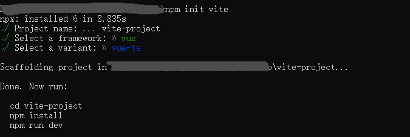

# Vue3-day01

## 一、Vue脚手架

Vue3官方文档地址：https://v3.cn.vuejs.org/

以前的官方脚手架@vue-cli也可以用，但这里推荐一个更轻快的脚手架Vite

脚手架网址：https://vitejs.cn/

### 1.1、Vite简介

> Vite（法语意为 "快速的"，发音 `/vit/`，发音同 "veet"）是一种新型前端构建工具，能够显著提升前端开发体验。它主要由两部分组成：
>
> - 一个开发服务器，它基于 [原生 ES 模块](https://developer.mozilla.org/en-US/docs/Web/JavaScript/Guide/Modules) 提供了 [丰富的内建功能](https://vitejs.cn/guide/features.html)，如速度快到惊人的 [模块热更新（HMR）](https://vitejs.cn/guide/features.html#hot-module-replacement)。
> - 一套构建指令，它使用 [Rollup](https://rollupjs.org/) 打包你的代码，并且它是预配置的，可输出用于生产环境的高度优化过的静态资源。
>
> Vite 意在提供开箱即用的配置，同时它的 [插件 API](https://vitejs.cn/guide/api-plugin.html) 和 [JavaScript API](https://vitejs.cn/guide/api-javascript.html) 带来了高度的可扩展性，并有完整的类型支持。
>
> 你可以在 [为什么选 Vite](https://vitejs.cn/guide/why.html) 中了解更多关于项目的设计初衷。

### 1.2、创建项目

创建项目命令：

```shell
npm init vite
```



创建出来的项目中并没有node_modules文件夹，所以按照上面的指引,进入项目文件夹后，执行`npm i`

## 二、更换Vue模板支持工具

以前我们用的Vue模板支持的VScode扩展是Vetur，使用TS+Vue3建议换成更加友好的Volar。

全程为： Vue Language Features (Volar) 

## 三、项目相关命令解析

package.json中提供了三个命令：

```json
"scripts": {
    "dev": "vite",    
    "build": "vue-tsc --noEmit && vite build",   
    "preview": "vite preview"   // 启动提供预览的服务器（这里预览的是打包的）
},
```

```shell
npm run dev --host   // 开发环境下的启动
npm run build   // 打包项目，项目目录多一个dist文件夹
npm run preview   // 启动提供预览的服务器（这里预览的是打包的）
```

## 四、生命周期钩子函数

官方文档：https://v3.cn.vuejs.org/api/composition-api.html#%E7%94%9F%E5%91%BD%E5%91%A8%E6%9C%9F%E9%92%A9%E5%AD%90

components文件夹下创建01-App.vue文件：

main.ts文件修改成：

```js
import { createApp } from 'vue'
import App from './components/01-App.vue'
```

01-App.vue文件中：

```vue
<script lang='ts'>
import { defineComponent,onBeforeMount, onMounted, onUpdated, onUnmounted } from "Vue"
export default defineComponent({
    setup () {
        
        onBeforeMount(()=>{
            console.log("执行了onBeforeMount");
        });
        onMounted(()=>{
            console.log("执行了onMounted");
        })
        console.log("执行了setup");
        
        return {

 
        }
    }
})
</script>
```


## 五、ref方法的几种使用方式

### 5.1、ref方法(操作基本类型数据)

02-App.vue文件中：

```vue
<template>
    <div>
        <p>{{num}}</p>
        <button @click="hdClick">按钮</button>
    </div>
</template>

<script lang="ts">
import { defineComponent } from "Vue"
export default defineComponent({
    setup(){
        // 什么时候执行，页面一刷新的时候
        console.log("setup");

        let num = 20;
        const hdClick = ()=>{
            num++
            console.log(num);
        }
		
        // 数据和方法都需要导出才能实现
        return {
            num,
            hdClick
        }
    }
})
</script>
```

但只是上面的写法并没有，num并不是响应式数据。Vue3提供了ref方法

```vue
<template>
    <div>
        <p>{{num}}</p>
        <button @click="hdClick">按钮</button>
    </div>
</template>

<script lang="ts">
import { defineComponent, ref} from "Vue"
export default defineComponent({
    setup(){

        let num = ref(20);   
        console.log(num);  // 直接访问是一个被包装过的数据
        
        const hdClick = ()=>{
            num.value++;   // 通过.value才能操作到数据。
            // 但模板上只需要{{num}}不需要，因为Vue3在模板编译阶段会把响应式数据num直接通过.value去获取。所以模板不需要改变
        }

        return {
            num,
            hdClick
        }
    }
})
</script>
```

### 5.2、ref方法(操作复杂类型数据)

```vue
<template>
    <div>
        <p>{{obj.num}}</p>
        <button @click="hdClick">按钮</button>
    </div>
</template>

<script lang="ts">
import { defineComponent, ref} from "Vue"
export default defineComponent({
    setup(){
        let obj = ref({
            num:30
        });   
        const hdClick = ()=>{
            obj.value.num++;   
        }
        return {
            obj,
            hdClick
        }
    }
})
</script>
```

### 5.3、ref方法获取标签

在模板上通过ref绑定标签，setup中通过ref();来获取

```vue
<template>
    <div>
        <p ref="count">p标签</p>
    </div>
</template>

<script lang="ts">
import { defineComponent, ref, onMounted,nextTick } from "Vue"
export default defineComponent({
    setup(){

        let count = ref(); // 这里拿到的是ref绑定为count的节点数据
        console.log(count.value); // setup生命周期还没有节点挂载
        onMounted(()=>{
            console.log("onMounted", count.value);  // 挂载后就可以通过.value拿到节点
        })
        nextTick(()=>{
            console.log("nextTick", count.value);  // 下一次dom更新后会触发的回调(只会触发1次)
        })
        return {
           count
        }
    }
})
</script>
```

## 六、reacttive方法和toRefs方法

reactive用来实现复杂数据类型的响应式

```vue
<script lang='ts'>
import { defineComponent , ref, reactive} from "Vue"
export default defineComponent({
    setup () {
        // 用ref实现基础数据类型的响应式，reactive实现复杂数据类型的响应式

        // 如果ref传入的是一个复杂数据，那么最后ref方法内部会调用到reactive
        //objRef.value和obj2Reactive一样
        let obj = {
            num:20
        }
        let objRef = ref(obj);
        console.log(objRef.value);
        
        let obj2 = {
            num:20
        }
        let obj2Reactive = reactive(obj2);
        console.log(obj2Reactive);

        return {

 
        }
    }
})
</script>
```

toRefs方法用来把reactive()处理过的数据处理成响应式结构出来：

```vue
<template>
<!-- toRefs方法 -->
    <div>
        <p>{{num}}</p>
        <button @click="num++">按钮</button>
    </div>
</template>

<script lang='ts'>
import { defineComponent , ref, reactive, toRefs} from "Vue"
export default defineComponent({
    setup () {

        
        let obj2 = {
            num:20
        }

        // 结构数据，需要通过toRefs方法处理，结构出来的数据出来的才是响应式数据
        let {num} = toRefs(reactive(obj2));
        console.log(num);

        return {
            num
 
        }
    }
})
</script>
```

## 七、setup语法糖

之前写的setup语法糖其实可以简写：

```Vue
<template>
    <div>
        <p>{{num}}</p>
        <button @click="num++">按钮</button>
    </div>
</template>

<script lang='ts' setup>
import { reactive,toRefs } from "Vue"

let obj = reactive({
    num:9
})

let {num} = toRefs(reactive(obj))
</script>
```

## 八、watch属性和watchEffect属性

watch属性和watchEffect属性都可以用于监听，watch写法上支持一个或者多个监听源，这些监听源必须只能是`getter/effect`函数，ref数据，reactive对象，或者是数组类型

```vue
<template>
<!-- watch 监听复杂类型数据 -->
    <div>
        <p>{{objRet.num}}</p>
        <button @click="objRet.num++">按钮</button>
    </div>
</template>

<script lang='ts' setup>
import { reactive,watch,watchEffect } from "Vue"
interface ObjItf{
    num:number
}
let obj ={
    num:50
}
let objRet = reactive<ObjItf>(obj);

// 监听的格式应该写成：()=>objRet.num
/* watch(()=>objRet.num,(newVal,oldVal)=>{
    console.log(newVal,oldVal);
});
 */
/* 或者下面这种格式 */
watch([()=>objRet.num],(newVal,oldVal)=>{
    console.log(newVal,oldVal);
})

/* watchEffect自带立即监听的效果 */
watchEffect(() => {
    // 当这个函数里面用到的值发生变化的时候就会 自动执行这个函数
    console.log(objRet.num);
});
</script>
```

## 九、Computed属性

计算属性作用和以前一样，格式也换成调用方法：

```vue
<template>
<!-- computed计算属性 -->
    <div>
        <p>{{dbnum}}</p>
        <button @click="num++">按钮</button>
        <p>{{dbnum2}}</p>
        <button @click="objRet.num++">按钮2</button>
    </div>
</template>

<script lang='ts' setup>
import { reactive,computed,ref } from "Vue"
let num = ref(20);
let dbnum = computed(()=>{
    return num.value*2
})
// -------------------------------
let obj = {
    num:10
}
let objRet = reactive(obj);
let dbnum2 = computed(()=>{
    return objRet.num*3
})
</script>
```


## 代码片段设置

完整版：

```json
{
	"demo": {
	  "prefix": "v3",
	  "body": [
		"<template>",
		"\t<div>",
		"\t\t",
		"\t</div>",
		"</template>",
		"",
		"<script lang='ts'>",
		"import { defineComponent } from \"Vue\"",
		"export default defineComponent({",
		"\tsetup () {",
		"\t\t$0",
		"\t\treturn {\n",
		" ",
		"\t\t}",
		"\t}",
		"})",
		"</script>",
		" ",
		"<style lang = \"less\" scoped>",
		"\t",
		"</style>"
	  ],
	  "description": "自定义的一个vue代码段"
	}
  }
```

简写版：

```json
{
	"demo": {
	  "prefix": "v3",
	  "body": [
		"<template>",
		"\t<div>",
		"\t\t",
		"\t</div>",
		"</template>",
		"",
		"<script lang='ts' setup>",
		"import {  } from \"Vue\"",
		"\t$0",
		"</script>",
		" ",
		"<style lang = \"less\" scoped>",
		"\t",
		"</style>"
	  ],
	  "description": "自定义的一个vue代码段"
	}
  }
```

