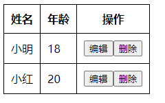
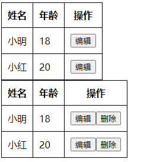

# Vue3-day02

## 一、v-model传值

父组件：

```vue
<template>
<!-- v-model传值 -->
    <Child v-model:num="num" ></Child>
</template>

<script lang='ts' setup>
import Child from "./01-AppChild.vue"
import { ref } from "vue"
let num = ref(31);
</script>
```

子组件：

```vue
<template>
    <div>
       <p>{{num}}</p>
       <button @click="hdClick" >按钮</button>
    </div>
</template>

<script lang='ts' setup>
    defineProps({
        num:{
            type:Number,
            default:999
        }
    })

    const emits = defineEmits<{
        (event:"update:num",n:number):void
    }>();

    const hdClick = () => {
        emits("update:num",100)
    }
</script>
```

还可以动态修改数据：

```vue
<script lang='ts' setup>
    let props = defineProps({
        num:{
            type:Number,
            default:999
        }
    })

    const emits = defineEmits<{
        (event:"update:num",n:number):void
    }>();

    let n = props.num
    const hdClick = () => {
        n++
        emits("update:num",n)
    }
</script>
```

## 二、插槽

### 2.1、匿名插槽

父组件：

```vue
<template>
<!-- 插槽、插槽作用域 -->
    <Child>
        <a href="#" >a标签</a>
        <button>按钮</button>
    </Child>
</template>
```

子组件：

```vue
<template>
    <div>
       <p>子组件:</p>
       <slot></slot>
    </div>
</template>
```

### 2.2、具名插槽

父组件：

```vue
<template>
<!-- 插槽、插槽作用域 -->
    <Child>
         <!-- <template v-slot:link> -->
        <template #link>
            <a href="#" >a标签</a>
        </template>
        

        <!-- <template v-slot:btn> -->
        <template #btn>
            <button>按钮</button>
        </template>
    </Child>
</template>
```

子组件：

```vue
<template>
    <slot name="btn"></slot>
    <p>子组件:</p>
    <slot name="link"></slot>
</template>
```

### 2.3、插槽作用域

父组件：

```vue
<template>
<!-- 插槽、插槽作用域 -->
    <Child>
         ...
        <!-- <template v-slot:btn> -->
        <!-- slot-scope 的写法已经废弃。 
            v-slot:插槽名="scope" 简写为 #插槽名="scope"-->
        <template #btn="scope">
            <button>按钮、{{scope.title}}、{{scope.mynum}}</button>
        </template>
        <!-- 插槽作用域的作用是在父组件内部使用子组件对应的slot标签 -->
    </Child>
</template>
```

子组件：

```vue
<template>
    <slot name="btn" title="哈哈" :mynum="num"></slot>
    <p>子组件:</p>
    <slot name="link"></slot>
</template>

<script lang='ts' setup>
import { reactive, toRefs } from 'vue';

let {num} = toRefs(reactive({
    num:20
}))
</script>
```

### 2.4、插槽作用域案例



#### 2.4.1、初始布局

父组件：

```vue
<template>
    <MyTable :arr="state.arr">
        
    </MyTable>
</template>

<script lang='ts' setup>
import MyTable from "./03-AppChild.vue"
import { reactive } from "Vue"
let state = reactive({
    arr:[{
        name:"小明",
        age:18
    },{
        name:"小红",
        age:20
    }]
})
</script>
```

子组件：

```vue
<template>
   <table>
       <tr>
           <th>姓名</th>
           <th>年龄</th>
           <th>操作</th>
       </tr>
       <tr v-for="item,index in arr" :key="index">
            <td>{{(item as {name:string}).name}}</td>
            <td>{{(item as {age:number}).age}}</td>
            <td><button>编辑</button></td>
       </tr>
   </table>
</template>

<script lang='ts' setup>

let props = defineProps({
    arr:{
        type:Array,
        default:[]
    }
})
</script>
 
<style scoped>
table{border-collapse: collapse;}
table,th,td{border: 1px solid #000;}
th,td{padding:10px}
</style>
```

#### 2.4.2、插槽使用

需求：第一个表格只有编辑按钮，第二个表格有编辑和删除按钮 



父组件：

```vue
<template>
<!-- 需求：第一个表格只有编辑按钮，第二个表格有编辑和删除按钮 -->
    <MyTable :arr="state.arr">
        <template #btns>
            <button>编辑</button>
        </template>
    </MyTable>
    <MyTable :arr="state.arr">
        <template #btns>
            <button>编辑</button>
            <button>删除</button>
        </template>
    </MyTable>
</template>
```

子组件:

```vue
<td><slot name="btns"></slot></td>
```

#### 2.4.3、点击编辑按钮获取本行数据（插槽作用域的使用）

父组件：

```vue
<template>
<!-- 需求：第一个表格只有编辑按钮，第二个表格有编辑和删除按钮 -->
    <MyTable :arr="state.arr">
        <template #btns="{index}">
            <button @click="hdClick(index)">编辑</button>
        </template>
    </MyTable>
    ...
</template>

<script lang='ts' setup>
import MyTable from "./03-AppChild.vue"
import { reactive } from "Vue"
...
const hdClick = (index:number)=>{
    console.log(state.arr[index]);
}
</script>
```

子组件：

```vue
<td><slot name="btns" :index="index"></slot></td>
```

#### 2.4.4、类型书写优化

子组件中上面的代码为了避免模板里面报错，书写了类型，其实模板上一般我们少写类型。所以可以做如下优化，

子组件中：

```vue
<td>{{item.name}}</td>
<td>{{item.age}}</td>

<script lang='ts' setup>
...
interface UserType{
    name:string;
    age:number;
}
let arr2 = props.arr as UserType[];

</script>
```

#### 2.4.5、全局接口抽取和ts全局配置

项目目录下，新建types文件夹，其中新建table.d.ts文件：

```ts
interface UserType{
    name:string;
    age:number;
}
```

在tsconfig.json中补充：

```json
  "include": [
    ...,
    "types/**/*.d.ts"
  ],
```

-----------------------------------

在你公司的项目中，如果table.d.ts文件中已经export，例如：

```js
export interface UserType{
    name:string;
    age:number;
}
```

则需要在组件中引入之后，才可以使用这个接口：

```js
import {UserType} from "../../types/table"
```

## 三、teleport传送门


## 四、类型增强

index.html

```html
<script>
    var globalVar = 'globalVar变量';
    var globalObj = { name: '', age: 20 };
    function fn(str) {
      console.log('fn函数' + str);
    }
</script>
```

组件中：

```js
console.log(globalVar, globalObj);
fn("")
```

如果上面几个变量和函数没有在全局做声明，会报红线，所以我们在types文件夹中创建common.d.ts文件：

```ts
declare var globalVar: string;
type ObjType = { name: string; age: number }
declare var globalObj: ObjType;
// 声明函数fn类型
declare function fn(s?: string): void;
```

## 五、第三方类型声明

在index.html中做jquery全局引入：

```html
<script src="http://libs.baidu.com/jquery/2.0.0/jquery.min.js"></script>
```

在组件中使用：

```js
console.log($("#app"));
$.ajax()
```

此时没有在全局声明的话，上面的写法也会报红线，在types文件夹中创建jquery.d.ts文件：

```js
declare function $(n: string):any;
/* declare let $: object;   重复报红*/
declare namespace $ {
    function ajax():void;
}
```

拓展关于namespace：

```ts
// 全局变量的声明文件主要有以下几种语法：
declare var 声明全局变量
declare function 声明全局方法
declare class 声明全局类
declare enum 声明全局枚举类型
declare namespace 声明（含有某方法的）全局对象
interface 和 type 声明全局类型
```

## 六、配置项目路径别名

目前ts对@指向src目录的提示是不支持的，vite默认也是不支持的。

所以需要手动配置@符号的指向

tsconfig.json中：添加两项配置

```js
"compilerOptions": {
    ...
    "baseUrl": "./",
    "paths": {
      "@/*": [
        "src/*"
      ],
      "#/*": [
         "types/*"
      ]
    }
},
```

添加完后就有提示了`import MyTable from "@/components/03-AppChild.vue"`，但这仅仅是ts的提示支持，去运行案例还会报错。这是因为vite默认不认识@符号的意思。

这时候就需要在vite.config.ts中添加配置(参考网址https://vitejs.cn/config/#resolve-alias)

```json
import path from 'path';

export default defineConfig({
  plugins: [vue()],
  resolve: {
    alias: {
      "@": path.join(__dirname, 'src'),
      "#": path.join(__dirname, 'types')
    }
  }
})
```

这时候引入的会path模块报红，但其实我们已经有node，所以就已经有path模块，只是缺少ts的一些声明配置。

所以需要安装关于node这个库的ts声明配置

```shell
npm i -D @types/node
```

安装成功就没有报红了,如果import后面的path报红，就把引入换成 `import * as path from 'path';`

